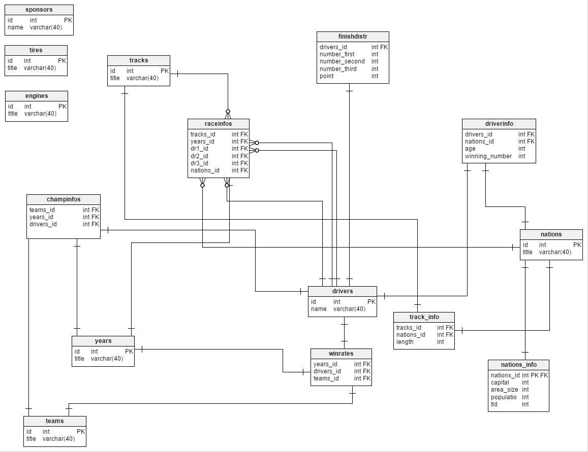

Developer Guide
=================

Database Design
------------------

Alper Akyıldız
+++++++++++++++

* Track list (Track Name, Track ID)
* Tire list (Tire Name, Tire ID)
* Track information (Track ID, Nation ID, Length, Type)
* Fastest lap distribution of drivers (# of Fastest Lap, Driver ID)

Bilal Enes Fedar
+++++++++++++++++++

* Nation list (Nation ID, Nation Name)
* Year list (Year ID, Year Number)
* Local race information (Track ID, Year ID, Dr. ID’s of 1st 2nd 3rd , Nation ID, Fastest Lap Driver)
* Most successful nations in local races

Mustafa Gökçeoğlu
+++++++++++++++++++++

* Team list (Team ID, Team Name)
* Engine list (Engine ID, Engine Name)
* Champions of years (Year ID, Dr. ID, Team ID)
* Driver winning rate (Win rate, Dr. ID)

Hanifi Demirel
+++++++++++++++++++

* Drivers List (Driver ID, Name)
* Sponsor List (Sponsor ID, Sponsor Name)
* Driver Info (Dr. ID, Nation ID, Age, World Rank, # of Wins)
* Finish Distribution (Dr. ID, # of 1st 2nd 3rd finishes)

ER Diagram
++++++++++++

   ER Diagram of Database

Implemented Parts
+++++++++++++++++++

.. toctree::
   :maxdepth: 1
   
   alper
   enes
   mustafa
   hanifi
