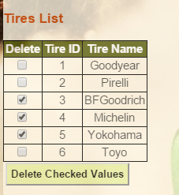

Parts Implemented by Alper Akyıldız
======================================

| In this part you can find tables of tracks, tires, track information and fastest lap numbers of drivers.

Track List Page
------------------

| This table contains track names and their id's.

.. figure:: images/tracklistmain.png
   :figclass: align-center

   Track list table

Track adding
+++++++++++++++++

| For adding new track you should write the new track name in the box of add track part and click the Add Track button.

.. figure:: images/addtrackexample.png
   :figclass: align-center

   Track adding example

Track deleting
++++++++++++++++++

| For deleting a track or tracks you should select the checkbox of that track and click the Delete Checked Values Button.

.. figure:: images/deletetrackexample.png
   :figclass: align-center

   Track deleting example

Track updating
+++++++++++++++++

| For updating the track name you should write the id of current track in the id part and write the new name of track in the new title box. After that you should click the Update Track button.

   Track updating example

Detailed Track Page
---------------------- 

| Track names are clickable links. If you click them, detailed information about that track will be shown. Detailed track page contains races held in every year, first three ranking of them and fastest driver of that race informations. 

   Detailed track page for Bosphorus Rally

Tire List Page
----------------

| This table contains tire names and their id's.

.. figure:: images/tirelistmain.png
   :figclass: align-center

   Tire list table

Tire adding
+++++++++++++++

| For adding new tire you should write the new tire name in the box of add tire part and click the Add Tire button.

.. figure:: images/addtireexample.png
   :figclass: align-center

   Tire adding example

Tire deleting
++++++++++++++++++

| For deleting a tire or tires you should select the checkbox of that tire and click the Delete Checked Values Button.

   Tire deleting example

Tire updating
+++++++++++++++++

| For updating the tire name you should write the id of current tire in the id part and write the new name of tire in the new title box. After that you should click the Update Tire button.

.. figure:: images/updatetireexample.png
   :figclass: align-center

   Tire updating example

Track Information Page
----------------------------

| This table contains track names, track id's, countries of tracks and length of tracks.

   Track information list table

Track information adding
+++++++++++++++++++++++++++++++

| For adding new track information you should write the new track name in the box of Name, select country from Country menu, write length in the box of length and click Add track info button.

   Track information adding example

Track information deleting
+++++++++++++++++++++++++++++

| For deleting a track information or track informations you should select the checkbox of that track and click the Delete Checked Values Button.

   Track information deleting example

Track information updating
+++++++++++++++++++++++++++++

| For updating the track information you should select old track name , write new name, select new country and write new length. Then you should click Update Track Info button.

   Track information updating example

Track information searching
++++++++++++++++++++++++++++++++++++

| For search a track or country in this table you should write a part of searched name in search box, then click Search button. This search operation is case-insensitive and searched characters can be any where of names or countries.

| For example if user search 'er' word, all of items that contain 'er' in track name or country will be shown. 

   Track information searching example

| Output of this search will be like that.

   Track information searching output for search 'er'

Fastest Lap Numbers Page
---------------------------

| This table contains number of having fastest lap time of racers. There is not add, delete or update functions of this table because it automatcally update according to races.

   Fastest lap numbers table