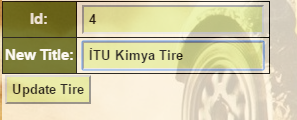

Parts Implemented by Alper Akyıldız
======================================

| In this part you can find tables of tracks, tires, track information and fastest lap numbers of drivers.

Track List Page
----------------

| This table contains track names and their id's.

   Track list table

Track adding
+++++++++++++++

| For adding new track you should write the new track name in the box of add track part and click the Add Track button.

   Track adding example

Track deleting
++++++++++++++++++

| For deleting a track or tracks you should select the checkbox of that track and click the Delete Checked Values Button.

   Track deleting example

Track updating
+++++++++++++++++

| For updating the track name you should write the id of current track in the id part and write the new name of track in the new title box. After that you should click the Update Track button.

.. figure:: images/updatetrackexample.png
   :figclass: align-center

   Track updating example

Tire List Page
----------------

| This table contains tire names and their id's.

.. figure:: images/tirelistmain.png
   :figclass: align-center

   Tire list table

Tire adding
+++++++++++++++

| For adding new tire you should write the new tire name in the box of add tire part and click the Add Tire button.

   Tire adding example

Tire deleting
++++++++++++++++++

| For deleting a tire or tires you should select the checkbox of that tire and click the Delete Checked Values Button.

.. figure:: images/deletetireexample.png
   :figclass: align-center

   Tire deleting example

Tire updating
+++++++++++++++++

| For updating the tire name you should write the id of current tire in the id part and write the new name of tire in the new title box. After that you should click the Update Tire button.

   Tire updating example

Track Information Page
----------------------------

| This table contains track names, track id's, countries of tracks and length of tracks.

.. figure:: images/trackinfomain.png
   :figclass: align-center

   Track information list table

Track information adding
+++++++++++++++++++++++++++++++

| For adding new track you should write the new tire name in the box of add tire part and click the Add Tire button.

   Tire adding example
