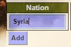

Parts Implemented by Bilal Enes Fedar
=========================================

| In this part you can find tables of nations, years, races and most succesfull nations.

Nations List Page
----------------

| This table contains nation names and their id's.

   Nation list table

Nation adding
+++++++++++++++

| For adding new nation you should write the new nation name in the box of Nation part and click the Add button.

   Nation adding example

Nation deleting
++++++++++++++++++

| For deleting a nation or nations you should select the checkbox of that nation and click the Delete Checked Values Button.

   Nation deleting example

Nation updating
+++++++++++++++++

| For updating the nation name you should write the id of current nation in the id part and write the new name of nation in the new title box. After that you should click the Update button.

   Nation updating example

Detailed Nation Page
------------------------

| Nation names are clickable links. If you click them, detailed information about that country will be shown. Detailed nation page contain some information about that country like population, capital city, area. Also this page have two tables. First of them shows information about races that have most audience from that country. Second one shows tracks that held in that country.

   Detailed nation page for Turkey

Year List Page
----------------

| This table contains years and their id's.

   Year list table

Year adding
+++++++++++++++

| For adding new year you should write the new year name in the box of add year part and click the Add button.

   Year adding example

Year deleting
++++++++++++++++++

| For deleting a year or years you should select the checkbox of that year and click the Delete Checked Values Button.

   Year deleting example

Year updating
+++++++++++++++++

| For updating the year name you should write the id of that year in the id part and write the new name of year in the new title box. After that you should click the Update button.

   Year updating example

Local Races Page
----------------------------

| This table contains track names, year of every tracks,first third ranking, most audience country and fastest lap informations.

   Local races list table

Race adding
+++++++++++++++++++++++++++++++

| For adding new race you should select the track name, year, first three driver, country, fastest driver and write fastest lap time.

   Race adding example

Race deleting
+++++++++++++++++++++++++++++

| For deleting a race  or races you should select the checkbox of that race and click the Delete Checked Values Button.

   Race deleting example

Race updating
+++++++++++++++++++++++++++++

| For updating the race you should set the track name, year, first three driver, country, fastest driver and write fastest lap time.

   Race updating example

Race searching according to track name
++++++++++++++++++++++++++++++++++++

| For search a race according to track name you should write a part of searched name of track in search box, then click Search button. This search operation is case-insensitive and searched characters can be any where of track names.

| For example if user search 'cla' word, all of items that contain 'cla' in track name will be shown. 

   Race searching according to track name example

| Output of this search will be like that.

   Race searching output for search 'cla' at track name

Race searching according to winner name
+++++++++++++++++++++++++++++++++++++++++++

| For search a race according to winner name you should write a part of searched name of winner in search box, then click Search button. This search operation is case-insensitive and searched characters can be any where of winner names.

| For example if user search 'Zqu' word, all of items that contain 'Zqu' in winner name will be shown. 

   Race searching according to winner name example

| Output of this search will be like that.

   Race searching output for search 'ZqU' at winner name

Most Successful Nations Page
---------------------------

| This table contains number of having most audience race of nations. There is not add, delete or update functions of this table because it automatcally update according to audience number of races.

   Most successful nations table