Parts Implemented by Hanifi Demirel
================================

| In this part you can find tables of drivers, finish distributions, sponsor and driver informations.

Driver list Page
----------------

| This table contains driver names and their id's.

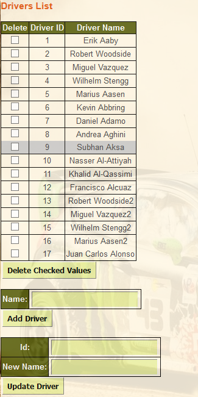

   Driver list table

Drivers adding
+++++++++++++++

| For adding new driver you should write the new driver name in the box of add driver part and click the Add Driver button.

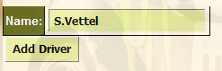

   Driver adding example

Drivers deleting
++++++++++++++++++

| For deleting a driver or drivers you should select the checkbox of that driver and click the Delete Checked Values Button.

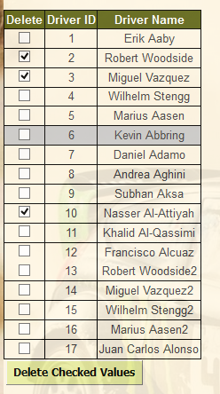

   Driver deleting example

Driver updating
+++++++++++++++++

| For updating the driver name you should write the id of current driver in the id part and write the new name of driver in the new Name box. After that you should click the Update Driver button.

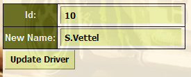

   Driver updating example

Finish Distribution Page
----------------------------

| This table contains driver ids, drivers names and their ranks(first rank, second rank, third rank).

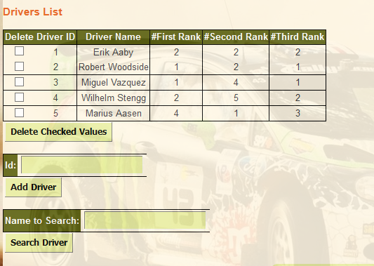

   Finish Distribution table

Driver adding
+++++++++++++++++++++++++++++++

| For adding new driver you should write the driver id in the box of add new driver part and click the Add Driver info button.

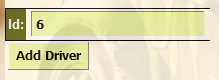

   Finish Distribution adding example

Driver deleting
++++++++++++++++++

| For deleting a driver or drivers you should select the checkbox of that finish distribution list and click the Delete Checked Values Button.

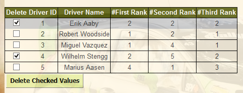

   Finish Distiribution deleting example

Driver searching
+++++++++++++++++

| For searching the drivers name you should write name in the search part. After that you should click the Search Driver button.

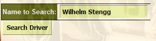

   Finish Distiribution searching example

Sponsor List Page
----------------

| This table contains sponsor names and their id's.

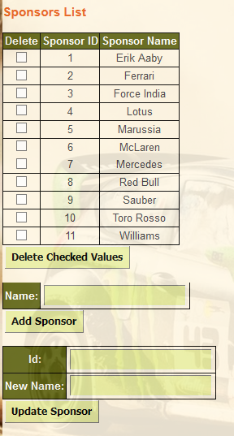

   Sponsor list table

Sponsor adding
+++++++++++++++

| For adding new sponsor you should write the new sponsor name in the box of add sponsor part and click the Add Sponsor button.

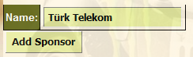

   Sponsor adding example

Sponsor deleting
++++++++++++++++++

| For deleting a sponsor or sponsors you should select the checkbox of that sponsor and click the Delete Checked Values Button.

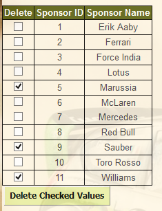

   Sponsor deleting example

Sponsor updating
+++++++++++++++++

| For updating the sponsor name you should write the id of current sponsor in the id part and write the new name of sponsor in the new Name box. After that you should click the Update Sponsor button.

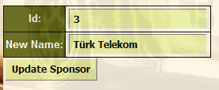

   Sponsor updating example

Driver Information Page
----------------------------

| This table contains driver ids, nations, ages, points and  number of winnigs.

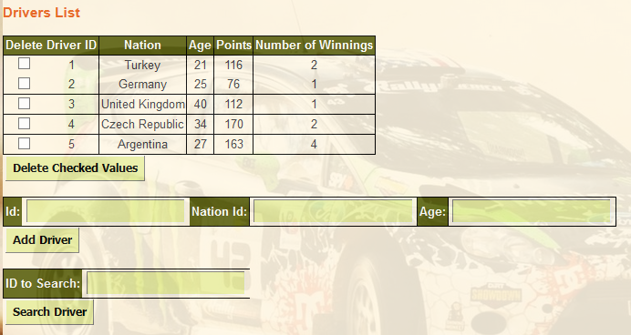

   Drivers Winning Rate table

Driver Information adding
+++++++++++++++

| For adding new driver information you should write the new id, new nation id, and age in the box of add driver information part and click the Add Driver button.

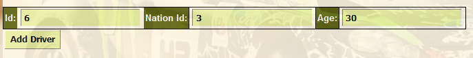

   Driver Information adding example

Driver Information searching
+++++++++++++++++

| For searching the drivers you should write driver id in the search part. After that you should click the Search Driver button.

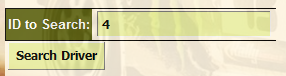

   Driver Information searching example

