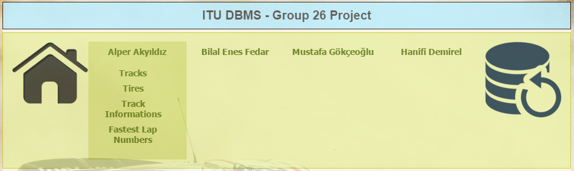

User Guide
=============

| This site designed for every user including inexperienced ones. Because of that usage is very simple.

Home Page
------------

| Home page is opening page of site. When user came this page shown. Home page contains navigation bar and main informations about rally.

.. figure:: images/homepage.png
   :figclass: align-center

   Home page

Navigation Bar
----------------

| Navigation bar is useful for finding the wanted page. This bar contains links of homepage, tables accordence to developers and database initialization.

   Navigation bar
   
Home Page Button
------------------

| If this button is clicked, homepage will be opened.

   Home Page Button

Initialize Database Button
----------------------------

| If this button is clicked, whole database will be recovered to default including all tables and records. 

   Initialize Database Button

.. toctree::
   :maxdepth: 1
   
   alper
   enes
   mustafa
   hanifi
   