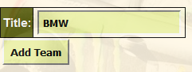

Parts Implemented by Mustafa Gökçeoğlu
================================

| There is a Teams, Engines, champions of years and drivers winning rate tables in this part. 

Team list Page
----------------

| This table contains team names and their id's.

   Team list table

Teams adding
+++++++++++++++

| For adding new team you should write the new team name in the box of add team part and click the Add Team button.

   Team adding example

Teams deleting
++++++++++++++++++

| For deleting a team or teams you should select the checkbox of that team and click the Delete Checked Values Button.

   Team deleting example

Team updating
+++++++++++++++++

| For updating the team name you should write the id of current team in the id part and write the new name of team in the new title box. After that you should click the Update Team button.

.. figure:: images/updateteamexample.png
   :figclass: align-center

   Team updating example

Engine List Page
----------------

| This table contains engine names and their id's.

   Engine list table

Engine adding
+++++++++++++++

| For adding new engine you should write the new engine name in the box of add engine part and click the Add Engine button.

   Engine adding example

Engine deleting
++++++++++++++++++

| For deleting a engine or engines you should select the checkbox of that engine and click the Delete Checked Values Button.

   Engine deleting example

Engine updating
+++++++++++++++++

| For updating the engine name you should write the id of current engine in the id part and write the new name of engine in the new title box. After that you should click the Update Engine button.

   Engine updating example

Champions of Years Page
----------------------------

| This table contains years, drivers names that are champion in that year and their teams.

   Champions of Years table

Champion adding
+++++++++++++++++++++++++++++++

| For adding new year you should write the new driver name which is champion that year, in the box of add new year part and click the Add Champion info button.

   Champions of Years adding example

Champion deleting
++++++++++++++++++

| For deleting a champion or champions you should select the checkbox of that champions of years and click the Delete Checked Values Button.

   Champion of Years deleting example

Champion updating
+++++++++++++++++

| For updating the champions of years you should write the current year in the year part and write the new year of champions in the new title box. After that you should click the Update Champ info button.

   Champions of Years updating example

Champion searching
+++++++++++++++++

| For searching the champions name or champions team you should write name or team name in the search part. After that you should click the Search Champion button.

   Champions of Years searching example

Driver Winning Rate Page
----------------------------

| This table contains id, drivers names, number of attanded races, number of first place and driver winning rate according to attanded and first place information.

   Drivers Winning Rate table
